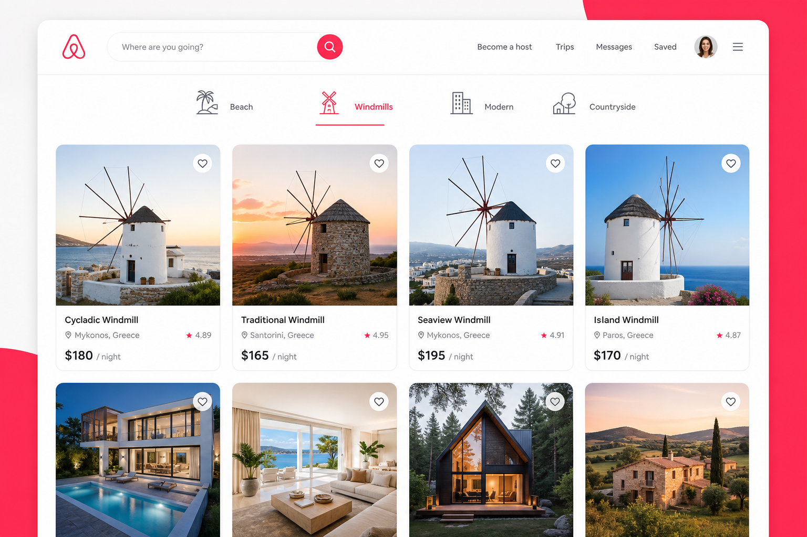

# Airbnb Clone



A full-stack property rental platform inspired by Airbnb. Browse listings by category, search with filters, book stays, manage your properties, and save favorites — built with Next.js, TypeScript, and MongoDB.

**Live demo:** [https://test-project-azsd8etqy-coder-ayoubs-projects-14feca06.vercel.app/?category=Windmills](https://test-project-azsd8etqy-coder-ayoubs-projects-14feca06.vercel.app/?category=Windmills)

---

## Features

- **Browse & filter listings** — Explore properties on the homepage with category filters (Beach, Windmills, Modern, Countryside, and more)
- **Advanced search** — Filter by location, date range, guest count, rooms, and bathrooms
- **Listing details** — View property info, interactive map, host details, and pricing
- **Reservations** — Book stays with date selection and total price calculation
- **Host your property** — Multi-step modal to create listings with Cloudinary image upload
- **Favorites** — Save and manage favorite listings
- **User dashboard** — Trips, reservations, and property management pages
- **Authentication** — Email/password, Google, and GitHub sign-in via NextAuth.js

---

## Tech Stack

| Layer | Technologies |
|-------|-------------|
| **Framework** | [Next.js 16](https://nextjs.org/) (App Router), React 19, TypeScript |
| **Styling** | [Tailwind CSS 4](https://tailwindcss.com/) |
| **Database** | [MongoDB](https://www.mongodb.com/) with [Prisma ORM](https://www.prisma.io/) |
| **Auth** | [NextAuth.js](https://next-auth.js.org/) (JWT, OAuth, Credentials) |
| **Images** | [Cloudinary](https://cloudinary.com/) |
| **Maps** | [Leaflet](https://leafletjs.com/) / React Leaflet |
| **State** | [Zustand](https://zustand-demo.pmnd.rs/) |
| **Forms** | React Hook Form |
| **Deployment** | [Vercel](https://vercel.com/) |

---

## Getting Started

### Prerequisites

- Node.js 18+
- MongoDB database (local or [MongoDB Atlas](https://www.mongodb.com/atlas))
- Cloudinary account (for image uploads)
- OAuth app credentials (optional, for Google/GitHub login)

### Installation

1. **Clone the repository**

   ```bash
   git clone https://github.com/your-username/airbnb-video.git
   cd airbnb-video
   ```

2. **Install dependencies**

   ```bash
   npm install
   ```

3. **Configure environment variables**

   Create a `.env` file in the project root:

   ```env
   DATABASE_URL="your-mongodb-connection-string"
   NEXTAUTH_SECRET="your-nextauth-secret"
   NEXTAUTH_URL="http://localhost:3000"

   GITHUB_ID="your-github-oauth-client-id"
   GITHUB_SECRET="your-github-oauth-client-secret"

   GOOGLE_CLIENT_ID="your-google-oauth-client-id"
   GOOGLE_CLIENT_SECRET="your-google-oauth-client-secret"

   NEXT_PUBLIC_CLOUDINARY_CLOUD_NAME="your-cloudinary-cloud-name"
   ```

4. **Run the development server**

   ```bash
   npm run dev
   ```

   Open [http://localhost:3000](http://localhost:3000) in your browser.

---

## Project Structure

```
app/
├── actions/          # Server actions (listings, reservations, favorites)
├── api/              # REST API routes
├── components/       # UI components (navbar, modals, listings, inputs)
├── hooks/            # Custom React hooks & Zustand stores
├── listings/         # Listing detail pages
├── favorites/        # Saved listings page
├── trips/            # User trip history
├── reservations/     # Host reservation management
├── properties/       # Host property management
└── libs/             # Prisma client & utilities

pages/api/auth/       # NextAuth configuration
prisma/               # Database schema
public/images/        # Static assets & README preview
```

---

## Available Scripts

| Command | Description |
|---------|-------------|
| `npm run dev` | Start development server |
| `npm run build` | Build for production |
| `npm start` | Start production server |
| `npm run lint` | Run ESLint |

---

## Key Pages

| Route | Description |
|-------|-------------|
| `/` | Homepage with listing grid and category filters |
| `/listings/[id]` | Individual listing with booking widget |
| `/favorites` | User's saved listings |
| `/trips` | Upcoming and past trips |
| `/reservations` | Reservations on your properties |
| `/properties` | Manage your hosted listings |

---

## License

This project is for educational purposes.

---

## Author

Built by **Ayoub coder** — practice project inspired by the Airbnb platform.
